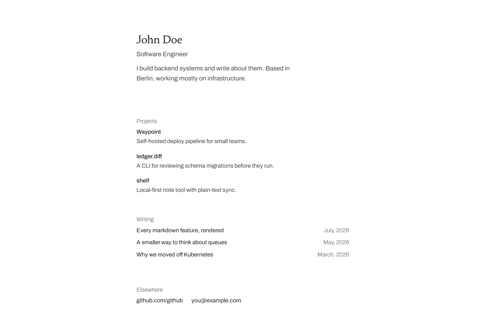

# Signature

A minimal Hugo theme: a heading, a few sections, and a writing list.



## Use

Copy the theme into you Hugo project (`themes/signature` directory)
and enable it in your site config:

```yaml
theme: "signature"
```

## Configure

The home page is driven entirely by site params:

```yaml
title: "Your Name"  # the display name
params:
  subtitle: "Software Engineer"
  description: "One or two lines about you."
  projects:
    - title: Example App
      description: Manages your examples.
      url: "https://example.com"
  elsewhere:
    - title: "github.com/you"
      url: "https://github.com/you"
    - title: "you@example.com"
      url: "mailto:you@example.com"
```

## Writing

Drop Markdown files in `content/writing/`. They appear in the home-page list
and each renders as its own post page.

```markdown
---
title: "Why we moved off Kubernetes"
date: 2026-03-14
---

Body text, headings, lists, and code blocks all supported.
```

Preview locally with `hugo server` (add `-D` to include drafts).

## Roadmap

- [ ] **SEO meta** — description, Open Graph / Twitter cards, canonical URL
- [ ] **Structured data** — JSON-LD `Person` (home) and `BlogPosting` (posts)
- [ ] **RSS autodiscovery** — link the `index.xml` Hugo already generates
- [ ] **`lang` from config** — currently hardcoded `en`
- [ ] **i18n** — UI strings into `i18n/`, localised dates, `hreflang`
- [ ] **Accessibility** — skip link, visible focus states, a11y pass
- [ ] **`section.html`** — `/writing/` index (currently 404s)
- [ ] **Post extras** — table of contents, pagination
- [ ] **Dark mode** — a second `:root` under `prefers-color-scheme`
